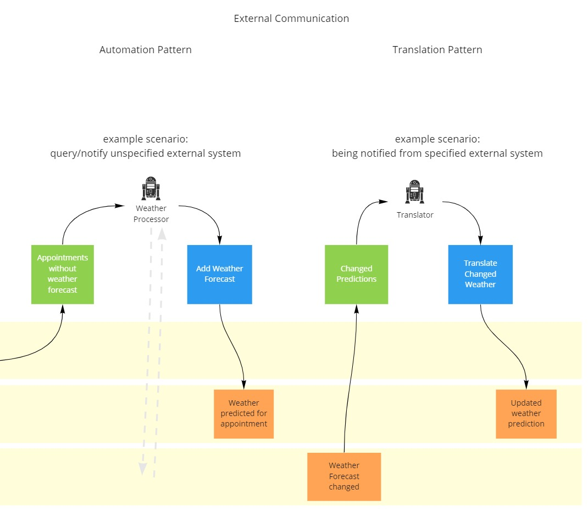

[high res version](cheatsheet.jpg)

If you host an EventModeling session it is important to get everyone on board quickly. The power of EventModeling lies in the simplicity of its building blocks and that it has only a few patterns. That means that people that are not familiar with it yet can get up to speed quickly.

Bring this sheet to your session in order to explain the pure basics.

# Building Blocks
On the left side there are the possible building blocks you can use in your Event Model:

* **Trigger**: An Interface which can be a UI or a public Rest-API. Or an automated process
* **Command**: Stands for an intention to change state.
* **View**: Stands for Conclusion, Report or ReadModel.
* **Event**: Stands for a business fact that has been saved to disk

On the right side the possible patterns are shown and how the building blocks are being connected:

# Patterns
* Patterns that are internal to the system:  **Command Pattern** / **Read Pattern**

* Patterns that automate and/or do external communication: **Automation Pattern** / **Translation Pattern**

