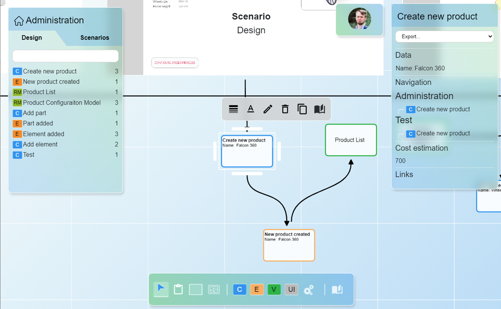

# Table of content:
1. [Community](#slack-videos)
2. [Videos](#intro-videos)
3. [Tools](#tools)

# Community
## [Slack Group](#slack-group) {#slack-group}

The community needed a non-technical discussion on Information System design. The Slack channel was created to create an environment where this type of discussion could happen and allow a new avenue for the practice to get adopted. You can join the community through this link:

## [Workshops](#workshops) {#workshops}

### Infozone Virtual Workshop on Nov 3rd 1500 - 1900 CET (Stockholm)

This online workshop will take you through the core concepts in Event Modeling along with some software walkthroughs (don't worry, no programming experience is necessary to participate). It is a virtualy event and will be hosted on Zoom with the exercises done in Miro. Please use the link below to register - seating is limited.

[Pay $25 USD Registration](https://buy.stripe.com/3cseVpb954zs43S000)

## [Laptop Stickers](#laptop-stickers) {#laptop-stickers}

* new designs are coming!

You'll be able to order these straight here for a small fee to cover printing and shipping - it's being set up right now. But the SVGs are provided as well in case you want to work on the design yourself or send it to your own printer to save on shipping and other costs.

[download](stickers.svg)

# [Intro Videos](#intro-videos) {#intro-videos}

A community discussion with the Copenhagen DDD meetup group done remotely. Here we start some Event Modeling exercises.



Event Modeling being explained to the DDD Greece meetup group.



This is an event model of an OAuth2 system shown from event modeling to implementation in Go.



[click here for part 2](https://www.youtube.com/watch?v=_iSiz_JBGGM)

An example project starting with Event Modeling and going all the way through to implementation. It's in Polish but the model and code is in English. A translation should be out in the near future.



This is the first public recording of a talk on Event Modeling. It was recorded at the Event-Driven Meetup in Seattle, WA. James Nugent was presenting on the Raft consensus algorithm that same night.



This is a discussion with Roy Osherove about Event Modeling and Event Sourcing. It gets into details of implementing systems using event storming that are described with event modeling.



# [Tools](#tools) {#tools}

## Online Modeling Tools:
### [Modellution (Beta)](https://www.modellution.com)

**Modellution** is a web platform designed for modeling information systems. It allows real-time visual collaboration, estimates, Jira & ClickUp integrations, and code-generation.
There's free commercial version available.

## [Realtime Board Template](#realtime-board-template) {#realtime-board-template}

In the demos of event modeling, [Miro Realtime Board](https://miro.com) is used. If you would like to get started from a small example, you can download the example event model above from [here](/event-modeling.rtb).

## [Implementation Gist](#implementation-gist) {#implementation-gist}

This script only requires [fish shell](https://github.com/fish-shell/fish-shell) and a couple of command line utilities to show the above example work. You can find it in a gist [here](https://gist.github.com/adymitruk//7fc2adb8598ad861d4b3dae114afd4c9).

